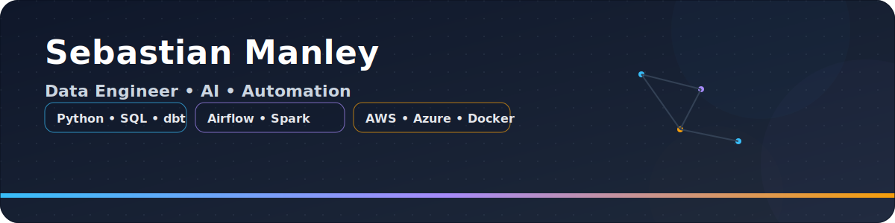

  

I’m a UK-based Data Engineer passionate about building scalable data pipelines, automating workflows, and creating AI-powered solutions that turn complex data into actionable insights.

Currently:  
- Working as a Data Engineer
- Building an AI entertainment App
- Contributing consultancy expertise to data engineering and automation projects, from strategy to execution

---

## Tech Stack
**Languages & Tools:**  
    
  
 
 
  
 
 
 
  

---

## Featured Projects
- **[Example 1](#)** → Python + Airflow → PostgreSQL → BI Dashboard  
- **[Example 2](#)** → LangChain + GPT + Vector DB  
- **[Example 3](#)** → Calculates ROI, yield & cashflow for investors  

---

## Connect With Me
  

